# Educational Practice Mini-Project Report

## 1. Title Page

Project title: Customer Churn Prediction

Academic group: Pending confirmation

Team name: StarTrio

Project track: Machine Learning

Project topic: Customer churn prediction using machine learning and Streamlit deployment

## 2. Team Members and Contributions

| No. | Full Name | Contribution |
|---|---|---|
| 1 | Kymbat Uagap | Team Leader / Machine Learning Engineer. Organized the project workflow and repository, performed preprocessing, trained and evaluated models, selected the final model, saved `churn_model.pkl`, and prepared ML screenshots and report materials. |
| 2 | Zhansaya Yerkenova | Data Analyst. Prepared the dataset, performed EDA, created visualizations, interpreted churn patterns, and provided findings for the report. |
| 3 | Saltanat Tlegen | Documentation & Project Integration. Organized documentation, compiled and formatted the report, prepared the contribution table, assisted with GitHub maintenance, and collected screenshots. |

## 3. Project Overview

This project is a machine learning mini-project for predicting customer churn. The system uses a customer churn dataset, performs preprocessing and exploratory data analysis, compares several machine learning algorithms, saves the best model, and deploys it in a Streamlit application.

The application allows a user to enter customer information and returns a churn prediction, a probability score, a risk level, and a summary of the values used for prediction.

## 4. Problem Statement

Customer churn is an important business problem because losing customers reduces revenue and increases the cost of acquiring new users. The goal of this project is to predict whether a customer is likely to leave the service based on customer profile, usage, support, payment, subscription, and interaction data.

The target variable is `Churn`:

- `1` means the customer left the service;
- `0` means the customer remained with the service.

## 5. Methodology / Tools and Technologies Used

The machine learning component was developed using Python and common data science tools.

Tools and technologies:

- Python
- Pandas
- NumPy
- Scikit-learn
- Matplotlib
- Seaborn
- Jupyter Notebook
- Streamlit
- GitHub Classroom
- Pytest

Data preprocessing included removing missing values, removing the identifier column `CustomerID`, one-hot encoding categorical variables, and splitting the dataset into train and test subsets.

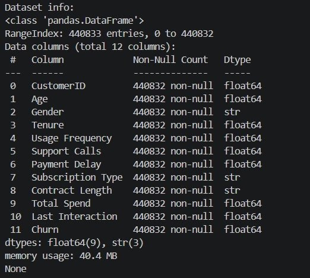

Figure 1. Dataset structure and feature information.

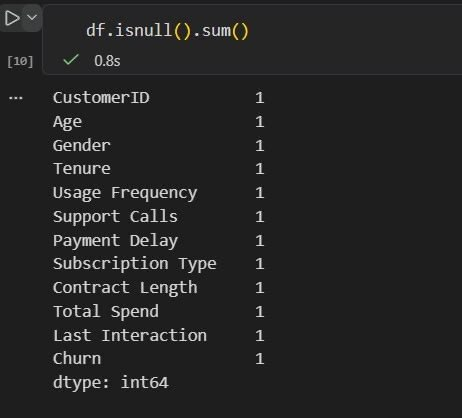

Figure 2. Missing value analysis.

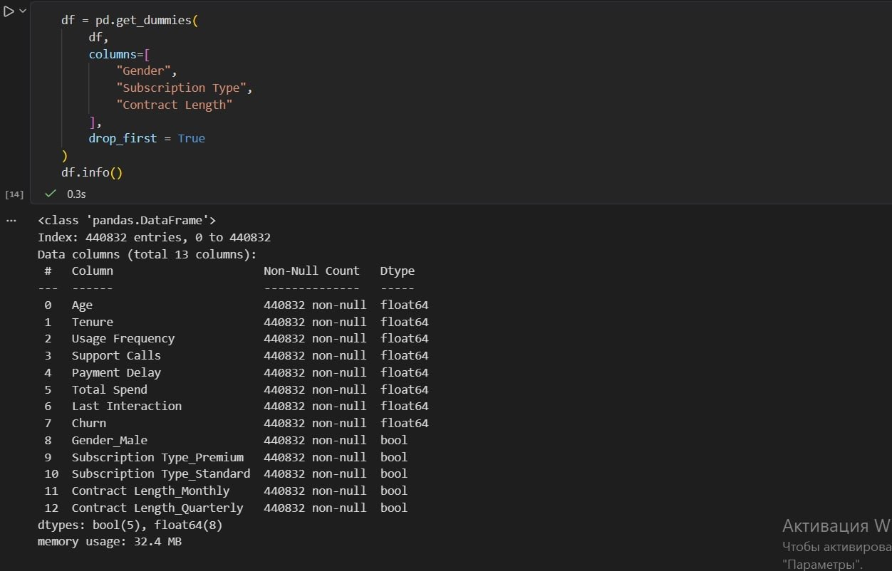

Figure 3. Dataset after categorical feature encoding.

## 6. Main Features / Model Description

Three machine learning algorithms were trained and compared:

- Logistic Regression
- Decision Tree Classifier
- Random Forest Classifier

The input features included age, gender, tenure, usage frequency, support calls, payment delay, subscription type, contract length, total spend, and last interaction.

The final Streamlit application includes required fields for age, monthly charges, contract length, and support calls. It also includes optional fields for tenure months, usage frequency, payment delay, last interaction, gender, and subscription type.

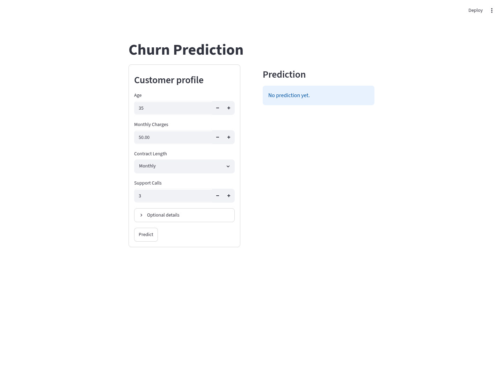

Figure 4. Streamlit application input form.

## 7. Implementation Explanation

The implementation follows these steps:

1. Load the dataset from `data/customer_churn_dataset-training-master.csv`.
2. Remove rows with missing values.
3. Remove `CustomerID`.
4. Convert categorical variables to numerical variables with one-hot encoding.
5. Split data into training and testing subsets.
6. Train Logistic Regression, Decision Tree, and Random Forest models.
7. Evaluate each model using accuracy and classification metrics.
8. Save the selected Decision Tree model as `models/churn_model.pkl`.
9. Load the model in `src/main.py`.
10. Convert Streamlit inputs into the exact model feature schema.
11. Display prediction, probability score, risk level, and input summary.

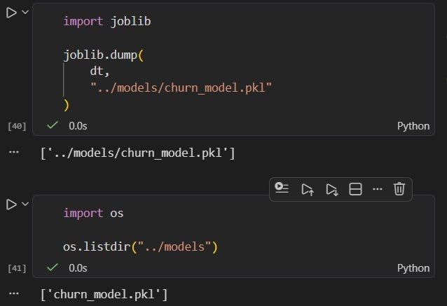

Figure 5. Saved model used by the application.

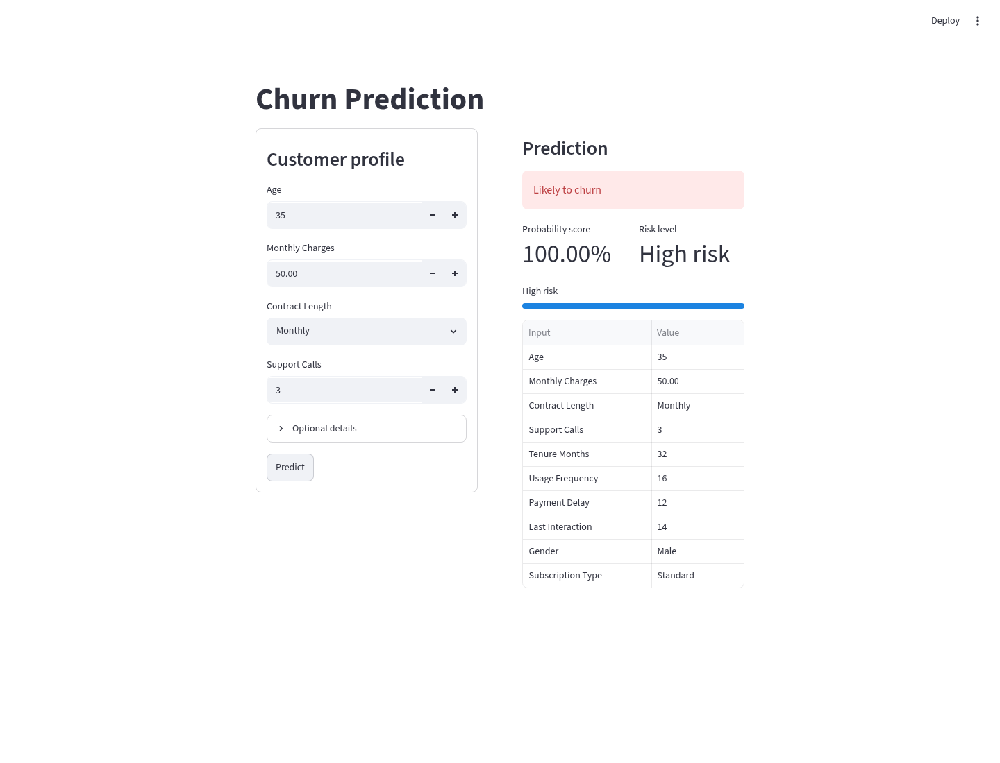

Figure 6. Streamlit prediction output.

## 8. Screenshots

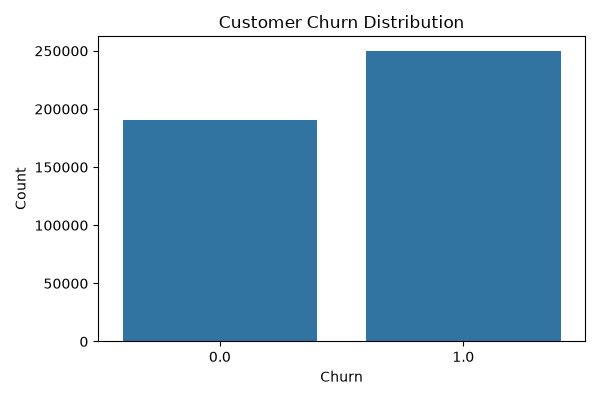

Figure 7. Churn distribution.

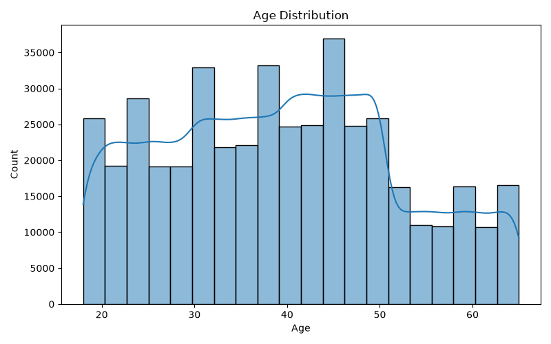

Figure 8. Age distribution.

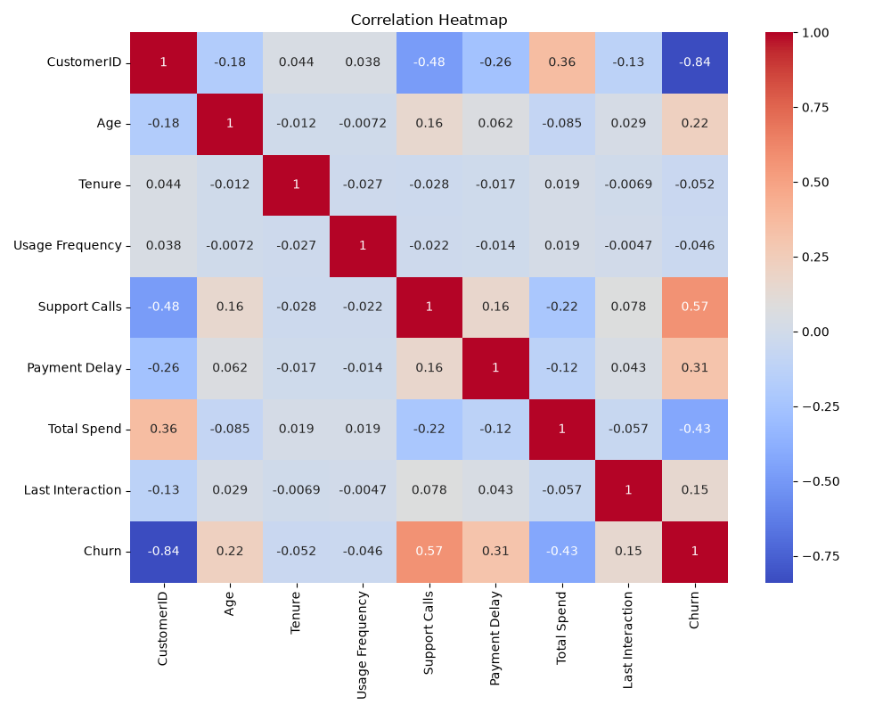

Figure 9. Correlation heatmap.

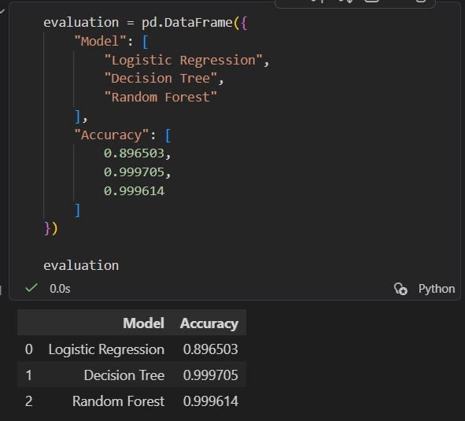

Figure 10. Accuracy comparison of all machine learning models.

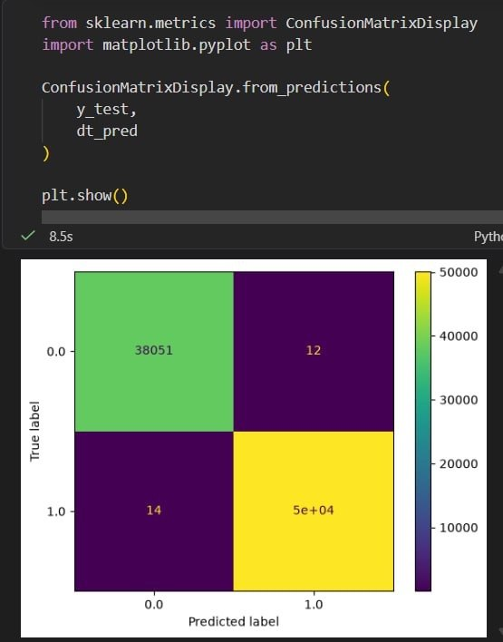

Figure 11. Confusion matrix of the selected model.

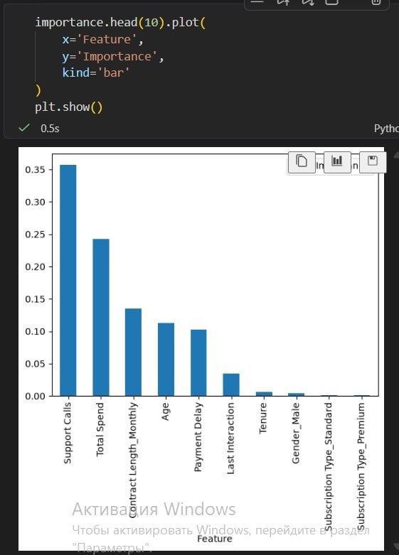

Figure 12. Feature importance visualization.

## 9. Testing or Evaluation Results

The performance of three machine learning models was evaluated using accuracy.

| Model | Accuracy |
|---|---:|
| Logistic Regression | 89.65% |
| Decision Tree | 99.97% |
| Random Forest | 99.96% |

The Decision Tree classifier achieved the highest accuracy and was selected as the final model for deployment.

Feature importance analysis showed that the strongest indicators were support calls, total spend, contract length, age, and payment delay.

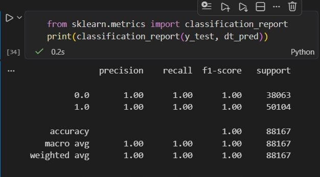

Figure 13. Classification report of the selected model.

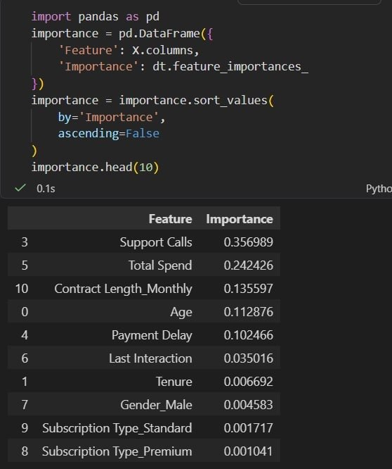

Figure 14. Feature importance values.

The application was also checked with automated tests. The tests verify that required project files exist, `src/main.py` runs successfully, the prediction input matches the model schema, and the prediction output is a valid binary label with a probability between 0 and 1.

## 10. Difficulties and Solutions

Difficulty: The dataset contained categorical features that could not be directly processed by machine learning algorithms.

Solution: One-hot encoding was applied to transform categorical values into numerical model inputs.

Difficulty: The saved model was trained with more features than the minimal application input requirements.

Solution: The Streamlit application builds a complete model input row using user-provided values plus median and mode defaults from the training dataset. This keeps the UI simple while preserving the trained model feature schema.

Difficulty: Model selection required comparison of multiple algorithms.

Solution: Logistic Regression, Decision Tree, and Random Forest models were trained and evaluated on the same train/test split. The highest-performing model was selected for deployment.

## 11. Conclusion

The team successfully developed a machine learning project for customer churn prediction. The project includes data preprocessing, EDA, model training, model evaluation, feature importance analysis, saved model deployment, Streamlit interface, screenshots, tests, and report materials.

The Decision Tree classifier achieved the best accuracy and was integrated into the application. The application can predict churn from customer profile and behavior inputs and displays the result in a clear format for users.

## 12. Links

GitHub repository link: https://github.com/aitu-educational-practice-2026/educational-practice-project-startrio

Instructor collaborator to add: `@bakhtiyar-k`
